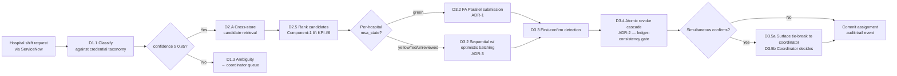
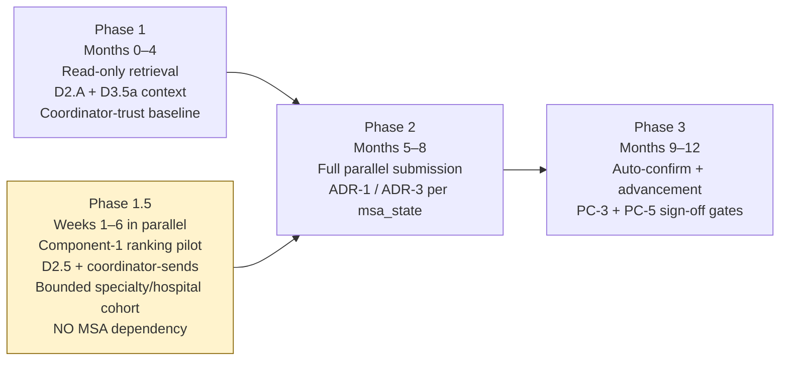
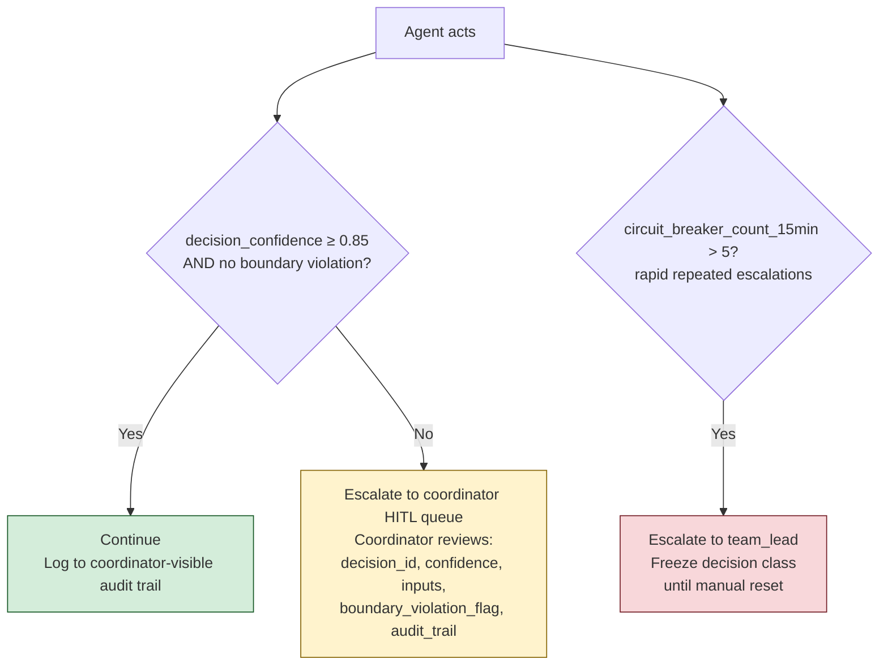
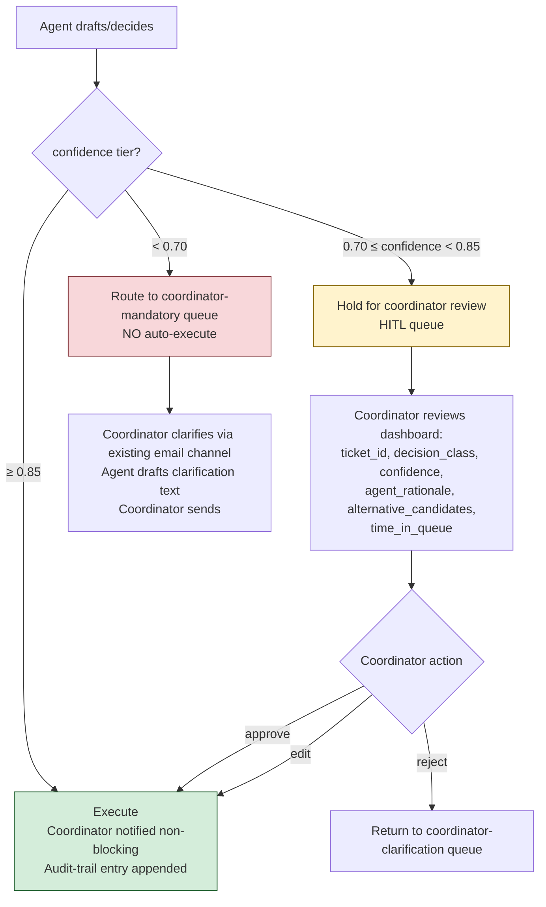
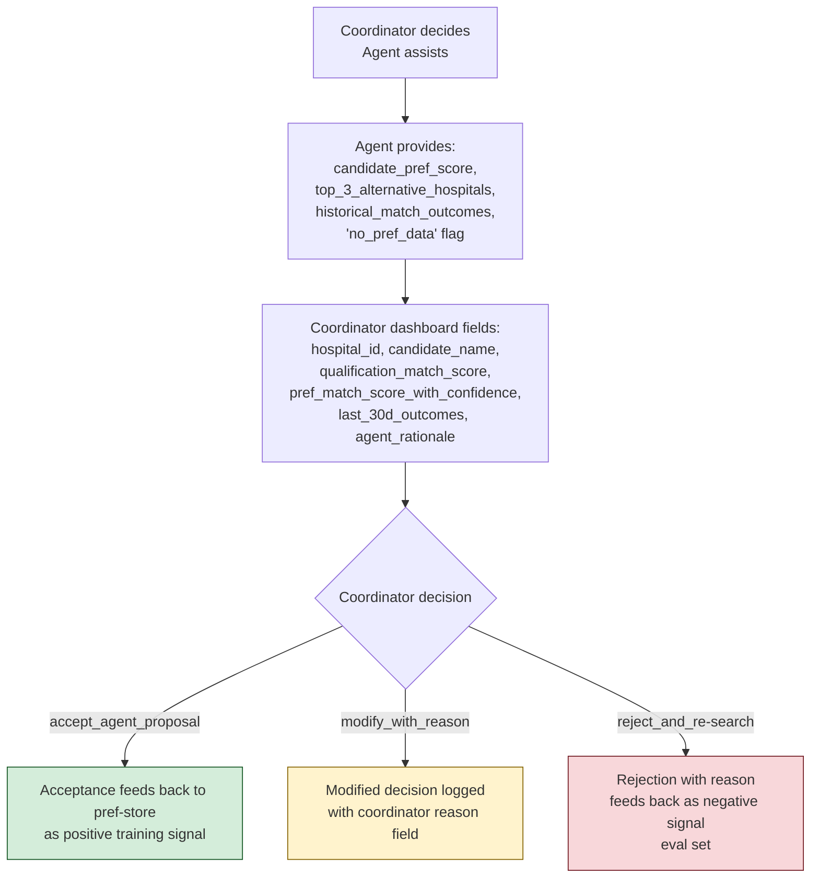
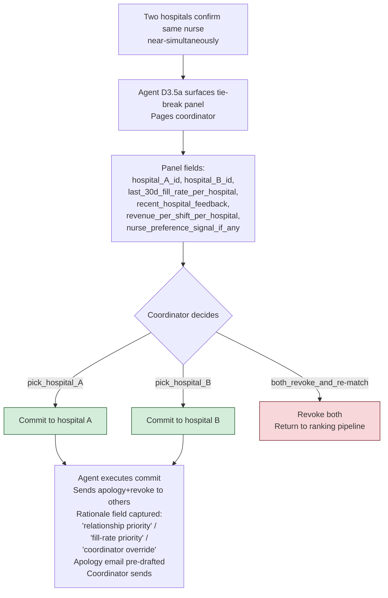

# Deliverable 3 — Agentic Solution Architecture + ADRs

**Author:** Tamas Kiss
**Engagement:** MedFlex agentic transformation  
**Date:** 2026-05-13
**Gate:** Gate 3 — Final submission

---

*Marcus's pushback (2026-05-13) drove two D3 revisions, recorded here and answered in full in D6: (1) addition of a **Phase 1.5 Component-1 ranking pilot** as a 6-week win-rate-moving slice inside the original Phase 1 window (P1 response); (2) **ADR-1 revisitation threshold realigned** with ADR-3's coexistence table (P2 response). The original Phase 1 de-risking spine and ADR-1/2/3 architectures remain intact.*

### Architecture overview

*[Lifted from `05-agent-purpose.md` opening scope sentence + §1a JtD Cognitive Contract]*

**Agent name (working):** MedFlex Match Orchestrator — Wave 1.

**Scope sentence (1 line):** Reads incoming hospital free-text shift requests; classifies them against MedFlex's credential taxonomy; produces a ranked candidate queue across the four nurse stores; submits candidates to N hospitals in parallel; atomically revokes on first-confirm; surfaces simultaneous-confirm tie-breaks to a coordinator; commits the (nurse, hospital, shift) triple with audit trail.

**Decides:**
- D1.1 Parse free-text → structured shift-request record (Agent-Led + Human Oversight; tier T2 above 0.85, T3 between 0.70–0.85, T4 below).
- D1.3 Detect classification ambiguity and route to clarification (ALHO).
- D1.4 Set queue priority (Fully Agentic, tier T1 within explicit boundaries).
- D2.A Cross-store candidate retrieval (Fully Agentic, T1; read-only).
- D2.5 Rank candidates by combined qualification + availability + preference + competitive-win scoring (ALHO).
- D3.2 Submit shortlisted candidate(s) to N hospitals in parallel (Fully Agentic, T1; revoke cascade is the safety boundary).
- D3.3 Detect "first hospital confirms" event from inbound channel (ALHO).
- D3.4 Atomic revoke cascade across parallel submissions (ALHO; ledger-consistency gate).
- D3.5a Surface tie-break context to coordinator (Fully Agentic, T1; retrieval + UI panel only, no recommendation).

**Supports (Human-Led + Agent Support; tier T3 by default):**
- D1.2 Identify hospital-preference references inside requests (proposes; coordinator approves).
- D2.4 Apply hospital-preference memory to candidate scoring (proposes; coordinator approves).

**Routes to human (Human-Only; tier T4):**
- D3.5b Simultaneous-confirm tie-break decision.

**Executes:**
- Reads ServiceNow ticket payloads (ticket body + portal-form fields + phone-transcribed text).
- Writes structured-classification records back to ServiceNow as ticket metadata.
- Queries the 4 nurse stores (credentialing / availability / request / preference) read-only.
- Reads + writes a new hospital-preference store (Wave-1 build).
- Writes submission-state transitions to a new submission-state ledger (Wave-1 build).
- Sends submission payloads to hospital email + portal channels using existing MedFlex accounts (hospitals see "MedFlex coordinator" sender; not a chatbot interface).
- Reads inbound hospital responses (email + portal events).
- Emits revoke messages on first-confirm; manages atomic ledger transitions.
- Surfaces tie-break panels to coordinator dashboard.
- Emits an immutable audit-trail event per decision (hash-chained).

### Architecture diagrams

**Per-request flow (steady-state Wave-1 architecture, Phase 2 onwards):**

**Wave-1 phase-gating (with Phase 1.5 pilot added per P1 pushback response):**

Phase 1 and Phase 1.5 run in parallel inside the 0–4 month window. Phase 1.5 is the 6-week win-rate-moving slice committed in the P2 response of the Marcus pushback memo (see D6). Phase 2's full parallel-submission architecture remains gated behind PB-3 MSA clearance per ADR-1.

### Agent decision points where contextual reasoning beats rules

*[Lifted from `03-delegation-matrix.md` §3 — Fully Agentic and Agent-Led + Human Oversight cells with their rationale (the FA and ALHO rows are precisely where contextual reasoning beats rules; HLAS / Human-Only rows kept for archetype completeness)]*

| D-id | Decision | Input Struct | Dec Determ | Tool Cov | Context Complex | Exc Rate | Latency | Risk/Compl | **Overall Archetype** | **Agent Action Boundary** |
|---|---|---|---|---|---|---|---|---|---|---|
| D1.1 | Parse free-text → taxonomy | L | H | H | M | M | H | M | **Agent-Led + Human Oversight** | **Must not** auto-finalise a classification with `confidence < 0.85` (routes to coordinator review). **Must not** send clarifying messages directly to the hospital — drafts only; coordinator sends. (Constraint #1 / A4-F1.) |
| D1.3 | Flag ambiguity | L | H | H | M | M | H | M | **Agent-Led + Human Oversight** | **Must not** auto-clarify by contacting hospital booking staff (Constraint #1 / A4-F1). **Must not** drop a `confidence < 0.70` ticket out of the queue — escalates to coordinator-clarification queue, never silently discarded. |
| D1.4 | Set queue priority | H | M | H | M | H | H | H | **Fully Agentic** | **Must not** demote a hospital below FIFO baseline without a logged relationship-rule citation; **must not** override a coordinator-set manual priority. **Why not Human-Oversight:** decision is reversible (priority can be re-set), low consequence per ticket, high volume (~240k/yr) makes HITL economically infeasible. |
| D2.A | Cross-store candidate retrieval | H | H | M | H | H | H | H | **Fully Agentic** | **Must not** write to any of the 4 stores — read-only. **Must not** infer a credential the candidate doesn't hold by document inference; only the credentialing DB's authoritative `credential_present=true` counts. **Why not Human-Oversight:** decision is a structured DB query; output is auditable; no value added by HITL on read-only retrieval. |
| D2.5 | Rank candidates | H | M | H | M | M | H | M | **Agent-Led + Human Oversight** | **Must not** finalise a candidate queue of count < 1; if no candidate clears `match_confidence ≥ 0.85` and `availability_confirmed`, holds for coordinator review (breakpoint B4). |
| D3.2 | Parallel submission | H | H | M | H | H | M | M | **Fully Agentic** | **Must not** submit a candidate to a hospital flagged `block_list=true` for that nurse (e.g., prior bad-fit feedback). **Must not** exceed `max_parallel_submissions` per nurse (default 5; PENDING_CALIBRATION) — beyond that, holds for coordinator review. **Why not Human-Oversight:** speed-to-submit is the primary win driver (BRIEF §1 L28); HITL on every submission would erase the throughput advantage; the revoke cascade (D3.4) is the safety boundary. |
| D3.3 | Detect first-confirm | M | H | M | H | H | M | M | **Agent-Led + Human Oversight** | **Must not** treat hospital-portal acknowledgements (`received` ≠ `confirmed`) as confirmation events. **Must not** trigger the revoke cascade without a `confirm_evidence_strength ≥ 0.85`. |
| D3.4 | Atomic revoke cascade | H | H | M | H | M | M | M | **Agent-Led + Human Oversight** | **Must not** complete a revoke cycle unless ledger-consistency check (`all parallel rows ∈ {REVOKED, COMMITTED_ELSEWHERE}`) passes. On consistency-check failure, **alerts coordinator immediately and freezes the nurse's submission state**. (Safety boundary per A3 L118 / R3.) |
| D3.5a | Surface tie-break context | H | H | H | M | M | H | H | **Fully Agentic** | **Must not** include a recommendation or rank in the tie-break panel — context only. Panel fields enumerated: `last_30d_fill_rate_per_hospital`, `recent_hospital_feedback`, `revenue_per_shift_per_hospital`, `nurse_preference_signal_if_any`. **Why not Human-Oversight:** retrieval + UI rendering, zero judgment introduced; HITL adds no information value. |

### Delegation archetypes per workflow

*[Lifted verbatim from `03-delegation-matrix.md` §7 Escalation Paths — the four canonical archetype escalation flows]*

For each archetype, the escalation flow. Numeric/boolean transitions only.

#### Fully Agentic (D1.4, D2.A, D3.2, D3.5a)

#### Agent-Led + Human Oversight (D1.1, D1.3, D2.5, D3.3, D3.4)

#### Human-Led + Agent Support (D1.2, D2.4)

#### Human-Only (D3.5b)

### Phase 1.5 — Component-1 ranking pilot deliverable

*Added 2026-05-13 per Marcus pushback P1 response (see D6).*

**Context:** Marcus's pushback identified that the Phase-1 read-only retrieval deliverable (D2.A + D3.5a context surfacing only) does not discharge KC-7's "value flow begins" framing for the 8-week milestone — coordinators looking up profiles faster is not a board-narratable change in competitive position. The Phase-1 framing internally contradicted KC-7 by gating any win-rate-moving capability behind PB-3 MSA clearance, which Marcus rejected as a deferred-trigger frame ("not a revisitation condition"). The substrate honesty requires explicit response: a 6-week win-rate-moving slice inside the original Phase 1 window.

**Decision:** Add a **Phase 1.5 Component-1 ranking pilot** as a parallel 6-week deliverable inside the Phase 1 (months 0–4) window. Phase 1.5 ships:

- **D2.5 candidate ranking** (ALHO archetype per D3 delegation matrix) operational on a **bounded specialty/hospital cohort** — single high-volume specialty within a focused hospital subset; exact scope identified Day 0 with Marcus + clinical leadership.
- **Coordinator-sends architecture**: the agent ranks; the coordinator submits. Structurally this is D3.5a (Fully Agentic context surfacing) extended with a ranked recommendation. **No parallel submission, no MSA dependency, no PB-3 gating.**
- **KPI #6 (Component-1 lift)** measured on the piloted cohort by Week 6 as the leading indicator of win-rate movement. Component-1 = qualification-accurate-submission rate; the 30%–70% sensitivity range from KC-7 applies to the volume share Component-1 explains of historical mismatch.

**Alternatives considered:**

1. **Single-hospital parallel-submit on a known-green MSA** (the most aggressive interpretation of "6-week win-rate-moving slice"). *Rejected:* depends on PB-3 MSA clearance landing for at least one hospital inside 6 weeks; Marcus's own legal-team feasibility critique (P2 of pushback) makes the timing unreliable. Coordinator-sends bypasses the MSA dependency entirely.

2. **Hold Phase 1 as-is and decline the 6-week ask** (hold scope). *Rejected:* the substrate (KC-7 vs Phase-1 phase-gating row) showed an internal inconsistency Marcus's pushback correctly surfaced. Holding scope would have meant defending a substrate flaw.

3. **Skip Phase 1, accelerate Phase 2 (parallel submission) directly** (most aggressive). *Rejected:* abandons the de-risking spine (R7.8 CRITICAL coordinator non-adoption, KC-12 trust-deficit, A2 store-access validation gates); replays Failure-2 pattern the spec is designed against.

**Consequences:**

- Phase 1 (read-only) and Phase 1.5 (ranking pilot) run in parallel within months 0–4.
- Phase 1.5 introduces **PB-Phase1.5-1, -2, -3** as pre-build operational requirements: bounded cohort identified Day 0; Component-1 measurement instrumentation in place Week 1; D2.5 ranking model trained on historical match data with cohort-restricted validation.
- Stream-2 ROI gets an earlier observable signal (Component-1 lift on piloted cohort, Week 6); Stream-3 (full parallel submission) sequencing unchanged — still gated behind PB-3 MSA clearance per ADR-1.
- The board-narratable artefact at the 8-week milestone is "Component-1 lift on piloted cohort, with measurable win-rate delta on this slice" — directly addresses KC-7's "value flow begins" framing.
- D7 validation plan carries the deferred CBL re-run note: the original gate2 closed-build-loop was performed against the pre-Phase-1.5 spec; re-validation needed for Phase 1.5 build path.

**Revisitation conditions:**

- Component-1 lift on piloted cohort at Week 6 fails to clear the lower bound of the KC-7 30%–70% sensitivity range → revisit Phase 1.5 ROI projection; may require ADR-4 (alternative win-rate-movement mechanism).
- Bounded cohort identification (PB-Phase1.5-1) slips past Day 7 → Phase 1.5 ship window compresses; consider extending Phase 1.5 to Week 8 or descoping to a single-hospital pilot.
- D2.5 ranking model under-performs Component-1 baseline on cohort-restricted validation by Week 1 → halt Phase 1.5 build; revert to Phase 1 spec without the pilot; surface to Marcus with revised commitment.

### ADRs

*[Lifted **verbatim** from `output/submit/adr.md`. All three ADRs reproduced byte-for-byte. The only adjustment is heading level (`## ADR-N` → `#### ADR-N`) to fit the Gate 3 heading hierarchy; body content is byte-identical to the source.]*

#### ADR-1 — D3.2 Fully Agentic parallel submission (with feasibility-gated default-block per hospital)

**Status:** ACCEPTED (Phase 10 USER-CONFIRMED Conflict-2 feasibility-dominant)
**Date:** 2026-05-12
**Decision-owner:** FDE Lead (with Marcus + MedFlex Legal as PC-1 sign-off pair)

**Context:** Speed-to-submit is the BRIEF's primary win/loss driver (BRIEF §1 L28). Coordinators today submit the same nurse to multiple hospitals in parallel (A3 L107) and revoke on first confirm — operationally standard, contractually unverified (A6 / KC-9 / R7.7). One MSA paragraph could turn day-1 parallel submission into a contractual breach.

**Decision:** D3.2 (parallel submission) is assigned the **Fully Agentic** archetype in DSM, BUT operates **fail-safe by default** — each hospital carries an `exclusivity_window_minutes` field defaulted to BLOCK until a Legal review of that hospital's MSA clears parallelism. Green-list hospitals (MSA reviewed, no parallel-prohibition) run FA. Yellow-list (MSA imposes exclusivity windows) and Red-list (MSA prohibits revoke-after-submit) route ALHO with coordinator sign-off per submission. PB-3 (MSA review) pulls forward from Pilot Week 1 to Day -3 of Phase-1 build.

**Alternatives considered:**

1. **Pure FA with PC-1 (Marcus + Legal) sign-off as the deployment lock** (value-dominant). *Rejected:* trusts Pilot Week 1 MSA review to clear top-20 by ship date. Risk of contractual breach on day 1 if any single MSA prohibits revoke-after-submit. Probability low (multi-submit is operationally normal); impact = top-tier hospital relationship damage + R7.7 materialisation. The Hartwood prior-failure pattern + Marcus's two prior AI failure post-mortems (A4) make trust loss cheap to incur and expensive to recover.

2. **Sequential-with-optimistic-batching** (the user-named fallback architecture). The agent submits to one hospital at a time but with a very short SLA (e.g. 15 min) before moving to the next; tracks `submission.acked_at` and proceeds as soon as the hospital signals received. Preserves the per-MSA exclusivity but slows the win-rate against parallel competitors. *Rejected as the Wave-1 default* because the speed advantage on green-list hospitals (~70% of volume per Q6 alternative (i)) is the largest single ROI driver in Stream 3. **Promoted as the standby architecture** for any hospital whose MSA is reviewed and found to require sequential submission — see ADR-3.

3. **D3.2 → ALHO (coordinator approves each submission)** (most conservative). *Rejected:* erases the speed-to-submit advantage entirely; replays the v3 anti-pattern of every-cell-Human-Led that AP-2 explicitly designs against; Wave-1 portfolio Y1 ROI collapses.

**Consequences:**

- Wave-1 build adds a per-hospital `msa_state` ENUM[`green`, `yellow`, `red`, `unreviewed`] field defaulted to `unreviewed`; agent treats `unreviewed` identically to `yellow` (no parallelism) until Legal sign-off.
- Stream-3 ROI conservative anchor degrades by ~30-40% on the share of submission volume that turns out to be yellow/red (a Q3 alternative-outcome [B] manifestation). This is the explicit honesty cost.
- PB-3 escalates to Day -3 priority alongside PB-1/PB-2/PB-6.
- The §3b Capability 4 rule block carries the MSA-gating filter as a hard predicate before parallelism is considered.

**Revisitation conditions:**

- Any single top-20 hospital lodges a contractual complaint about parallelism → re-rank that hospital to red; expand red-list scoring assumption; trigger Probe A2-class re-review.
- Legal review (PB-3) returns "<50% of top-20 MSAs are green-list" → revisit the decision; promote ADR-3 (sequential-with-optimistic-batching) from standby to default; collapse the FA archetype back to ALHO. (The 50–79% green-list scenario is handled inline by per-hospital `msa_state` routing per ADR-3 coexistence table — ADR-1 and ADR-3 coexist at per-submission granularity without architecture-level revisitation; only the <50% green-list scenario triggers full ADR-1 revisitation. Threshold realigned with ADR-3 coexistence table 2026-05-13 per Marcus pushback P2 response; see D6.)
- Hospital-trust signal (revoke-tone audit per Joint-Stakeholder C-CA5) drifts negative for 4 consecutive weeks → suspend parallelism for the affected hospital(s); revisit the ROI conservative anchor.

#### ADR-2 — Atomic revoke cascade as the safety boundary for parallel submission (D3.4)

**Status:** ACCEPTED
**Date:** 2026-05-12
**Decision-owner:** FDE Engineering Lead (with PC-3 = FDE Eng Lead + Senior Coord champion as deployment sign-off pair)

**Context:** ADR-1 enables parallel submission on green-list hospitals; once one hospital confirms a candidate, all other parallel submissions for the same nurse must be retired atomically. Orphan submissions (one parallel target still in `SUBMITTED` state after another has been `COMMITTED`) damage hospital trust; that damage is what A3 L118 explicitly calls "the safety boundary." Distributed-system atomicity is non-trivial; without an explicit safety boundary, the agent's speed advantage compounds with reputation risk.

**Decision:** D3.4 (atomic revoke cascade) is assigned **Agent-Led + Human Oversight** archetype with the **ledger-consistency check as a hard gate**: before any `assignment.state` transitions to `COMMITTED`, the agent must verify `all sibling submissions ∈ {REVOKED, COMMITTED_ELSEWHERE}`. On consistency-check failure, the assignment freezes (`INCONSISTENT_FROZEN`) and the coordinator owns recovery. The agent owns the consistency check + freeze; the human owns the recovery path — that separability is what makes D3.4 ALHO and not Human-Only.

**Alternatives considered:**

1. **Two-phase commit across all sibling submissions** (strict distributed transaction). *Rejected:* hospital response channels do not support a 2PC protocol; the agent has no transactional handle on the hospital end. Practically un-implementable.

2. **Eventual consistency with periodic reconciliation** (loose; "we'll clean it up overnight"). *Rejected:* the revoke window is hours, not days (A1 L77); a stuck submission for 8h is a hospital-trust incident, not a reconciliation artefact.

3. **Coordinator-gated commit on every assignment** (force human approval before the COMMIT state). *Rejected:* erodes the speed-to-submit advantage on the 95%+ of cases where the cascade is clean; reverts the spec toward HLAS-everywhere which AP-2 designs against.

**Consequences:**

- Submission state machine carries 11 states including `REVOKE_PENDING` / `REVOKED` / `REVOKE_STUCK` / `COMMITTED_ELSEWHERE` (APD §2).
- Ledger-consistency check is a hard gate per APD §3b Capability 5 + CLAUDE.md §10 validation rules.
- ET-9 circuit-breaker fires on `ledger_consistency_failure_rate > 1.0%` per 24h → halt Stream 3 D3.2 autonomy.
- R3 (revoke cascade atomicity failure) is the named risk; R7.18 names the operational variant (alarm at 02:14 Sunday with no on-call).

**Revisitation conditions:**

- Ledger inconsistency rate exceeds 0.5% sustained 14 days at any Wave-1 phase → re-architect: ADR-3 (sequential-with-optimistic-batching) becomes the default, eliminating the revoke-cascade altogether at the cost of speed.
- Audit-trail tamper detection (R7.13 / Adversarial A8) surfaces a privilege-escalation finding → add off-DB witness commitment per A8 proposed answer; revisit ADR-2.
- Hospital portal RPA fragility (Adversarial A9) drops revoke success rate below 95% on any tier → suspend FA on that tier; route ALHO until revoke channel hardened.

#### ADR-3 — Sequential-with-optimistic-batching as the standby submission architecture (for MSA-restricted hospitals + ADR-1 promotion path)

**Status:** ACCEPTED (standby; activated per ADR-1 revisitation conditions)
**Date:** 2026-05-12
**Decision-owner:** FDE Engineering Lead

**Context:** ADR-1 chose Fully Agentic parallel submission as the Wave-1 default for green-list hospitals. But the spec must carry a *load-bearing fallback* for hospitals whose MSAs are reviewed and found to prohibit parallel submission OR impose exclusivity windows that make parallelism a contractual liability. Per Phase 10 Conflict-2 USER-CONFIRMED resolution, that share of volume is up to 30% in the worst case (Q3 alternative-outcome [B]). The fallback must preserve as much of the speed advantage as possible without breaching contract.

**Decision:** For yellow/red MSA hospitals (and as a Wave-1-wide replacement architecture if the Pilot Week 1 MSA review surfaces ≥80% non-green-list hospitals per ADR-1 revisitation condition): the agent runs **sequential submission** to one hospital at a time, with **optimistic batching** — as soon as a hospital signals `ACKED_BY_HOSPITAL` (channel-level receipt, distinct from `CONFIRMED`), the agent proceeds to the next hospital in the candidate's priority order. The submission stays open at the prior hospital; the agent does NOT pre-emptively close it. The first hospital to escalate from `ACKED_BY_HOSPITAL` to `CONFIRMED` wins; later confirms get the standard revoke message (no parallelism-on-confirm to revoke).

**Key behaviours of optimistic batching:**

- The agent tracks a per-candidate **priority queue** of hospitals (ranked by `last_30d_fill_rate_per_hospital` × `qualification_match_score`; same ranking inputs as D2.5).
- Per-hospital `ack_timeout_minutes` (default 15 min; PENDING_CALIBRATION per hospital) — if no `ACKED_BY_HOSPITAL` event arrives, the agent moves to the next hospital in priority order.
- Multiple submissions can exist in `SUBMITTED` or `ACKED_BY_HOSPITAL` state for the same candidate simultaneously — this is *not* parallelism, because the agent is not actively soliciting from multiple hospitals at once; submissions just don't auto-retire on receipt-ack.
- On `CONFIRMED` event: standard revoke cascade to any other open submission for that candidate (`REVOKE_PENDING → REVOKED` per ADR-2). The cascade is much smaller than ADR-1 (typically 1-2 outstanding submissions instead of 3-5).
- For hospitals with explicit exclusivity-window MSA paragraphs: the agent does NOT proceed to next hospital until the prior hospital's exclusivity window expires.

**Alternatives considered:**

1. **Hard sequential** (one hospital at a time, wait for explicit reject before moving on). *Rejected:* hospital silent-rejection (B8) is common (median time-to-reject = hospital_silent_timeout = 6h); waiting on silent rejections erases the time advantage entirely. Sequential-with-optimistic-batching exploits the 15-min ack as the proceed signal, capturing ~70% of the speed advantage of parallel submission without the MSA risk.

2. **Coordinator-mediated sequential** (every submission requires coordinator approval before send). *Rejected:* reverts to HLAS-everywhere on yellow/red volume; same critique as ADR-1 alternative 3.

3. **Hospital-rotation parallelism** (parallel within a sub-batch of N=2 hospitals, then revoke and rotate). *Rejected:* this is still parallelism; if the MSA prohibits revoke-after-submit, even N=2 parallelism violates it.

**Consequences:**

- ADR-3 is dormant in Wave-1 build but *implemented*; the same submission state machine (APD §2) accommodates both ADR-1 and ADR-3 with only the per-hospital `parallel_enabled` boolean toggling between them.
- Per-hospital throughput on ADR-3 architecture is ~50-70% of ADR-1 (Stream-3 conservative ROI on yellow/red volume degrades to ~$200-280k/yr from the $535k full anchor; per Adversarial Probe A9 sensitivity discussion).
- The revoke cascade is much smaller; ledger-consistency failure rate drops mechanically; R3 / R7.18 risk profile improves on the ADR-3 share of volume.
- The Coach probe C5 (Kim TBC champion sign-off) extends to ADR-3 activation: if the Pilot Week 1 MSA review surfaces the ≥80% non-green-list scenario, the Wave-1 architecture defaults to ADR-3, and that decision needs PC-1 (Marcus + Legal) sign-off; senior coord champion does not gate this decision, but per the coordinator-data-use covenant (Phase 10 O1) the senior champion is informed and may flag adoption-risk concerns.

**Revisitation conditions:**

- Pilot Week 1 MSA review reveals ≥80% green-list hospitals → ADR-3 stays standby; ADR-1 is the operational architecture.
- Pilot Week 1 MSA review reveals 50-79% green-list → ADR-1 and ADR-3 coexist; per-hospital `msa_state` field gates the per-submission architecture choice.
- Pilot Week 1 MSA review reveals <50% green-list → revisit ADR-1 (likely promote ADR-3 to default Wave-1 architecture; re-baseline Stream-3 ROI to the ~50-70% throughput floor).
- Speed-to-submit advantage on ADR-3 architecture measured at end of Phase 3 to be < +20% over baseline → revisit the win-rate model + competitive-intel data sources; may require ADR-4 (a fundamentally different speed-vs-trust trade-off).

